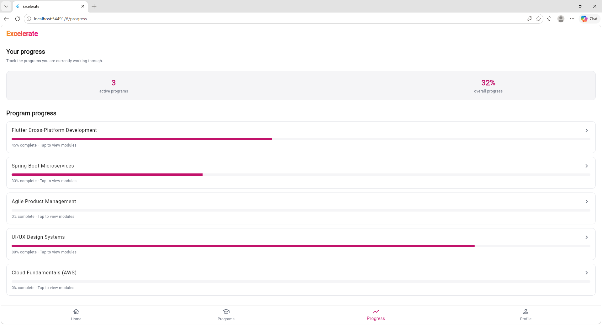
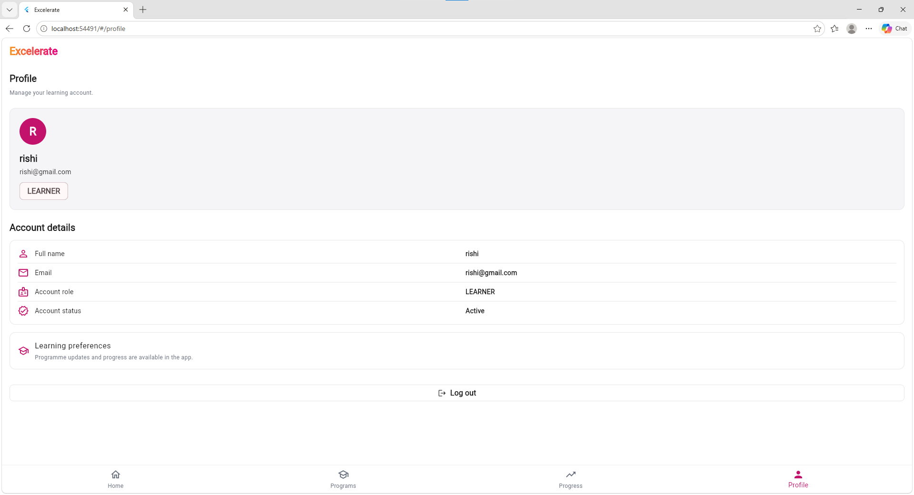

# Excelerate

Excelerate is a Flutter-based mobile learning companion for browsing experiential learning programs, tracking progress, enrolling in programs, and submitting feedback. The project combines a cross-platform Flutter client with a local `json-server` mock API so the app can be built and demonstrated without a production backend.

## Project overview

This repository contains a working mobile prototype for a learner experience focused on skill discovery and program engagement. The application supports:

- User registration and sign-in
- Program discovery via searchable catalog and category filters
- Detailed program information and route-based navigation
- Enrollment tracking for a learner
- Feedback submission for a chosen program
- Session persistence with `shared_preferences`
- Loading, validation, retry, and API error states

The app is designed as a demo-ready learning platform rather than a full production system, and it intentionally uses a mock REST API to simulate real backend behavior.

## Objectives

The project aims to:

- Provide a mobile interface for discovering development and learning programs
- Model the learner journey from sign-in to program selection and enrollment
- Demonstrate clean Flutter architecture with repositories, services, and UI screens
- Show how a mock backend can power authentication, catalog data, and user actions
- Create a practical portfolio-style app for learning and demo purposes

## Current implementation

The app currently includes the following core flows:

1. Login screen
2. Registration screen
3. Home dashboard
4. Programs listing screen
5. Program details screen
6. Enrollment form
7. Feedback submission screen
8. Progress and profile placeholders for future expansion

The navigation logic is defined in the app entrypoint and routes are registered in the Flutter app.

## User flow

```text
Login / Register
   ↓
Home dashboard
   ↓
Programs catalogue
   ↓
Program details
   ├── Enroll
   └── Submit feedback
```

## Screens

The app includes a set of screens implemented in `Mobile/lib/screens/`:

- `login_screen.dart`
- `registration_screen.dart`
- `home_screen.dart`
- `programs_screen.dart`
- `program_details_screen.dart`
- `enrollment_screen.dart`
- `feedback_screen.dart`
- `progress_screen.dart`
- `profile_screen.dart`

## Technology stack

### Frontend

- Flutter
- Dart
- Material Design UI
- `provider` for shared app state

### Persistence and networking

- `http` for REST requests
- `shared_preferences` for mock session storage
- `json-server` for a local mock API

### Project tooling

- Flutter SDK
- Node.js
- npm
- GitHub for repository and versioning

## Architecture and project structure

```text
excelerate-app/
├── Mobile/                             # Flutter application
│   ├── lib/
│   │   ├── core/
│   │   │   └── api/                    # API client, constants, exceptions
│   │   ├── models/                     # User, program, enrollment, feedback models
│   │   ├── providers/                  # Session state management
│   │   ├── repositories/               # API-backed repositories
│   │   ├── screens/                    # App screens
│   │   ├── services/                   # Additional services and token storage
│   │   ├── theme/                      # Brand-related styling and app theme
│   │   ├── widgets/                    # Shared UI state widgets
│   │   ├── main.dart                   # App entry point and route configuration
│   │   └── ...
│   ├── test/
│   ├── pubspec.yaml
│   ├── analysis_options.yaml
│   ├── run_with_mock_api.ps1
│   └── start_mock_api.ps1
├── mock-api/
│   ├── db.json                         # Mock users, programs, enrollments, and feedback
│   ├── routes.json                     # JSON server route configuration
│   ├── package.json                    # Mock API dependencies and start script
│   └── README.md
├── image.png
├── image-1.png
├── image-2.png
├── image-3.png
├── image-4.png
├── image-5.png
├── image-6.png
├── image-7.png
├── image-8.png
├── image-9.png
├── image-10.png
|
├── README.md
└── .gitignore
```

## Flutter setup

### Prerequisites

- Flutter SDK 3.0.0 or later
- Dart SDK compatible with the Flutter version
- Android Studio, Xcode, VS Code, or a physical device
- Git

### Install dependencies

```bash
cd Mobile
flutter pub get
```

### Run the app

```bash
cd Mobile
flutter run
```

For Windows local development, the project includes a helper script to start the mock API and launch Flutter together:

```powershell
cd Mobile
.\run_with_mock_api.ps1
```

This script is intended for local development and uses the mock API on port `3000`.

## Mock REST API setup

The project includes a mock API under `mock-api/` powered by `json-server`.

### Install API dependencies

```bash
cd mock-api
npm install
```

### Start the API

```bash
cd mock-api
npm start
```

The API listens on:

- `http://localhost:3000` for web and iOS simulator
- `http://10.0.2.2:3000` for Android emulator

The app configuration in `Mobile/lib/core/api/api_constants.dart` automatically selects the correct base URL based on the device runtime.

## API integration

The Flutter client communicates with the mock API through a centralized HTTP client:

- `Mobile/lib/core/api/api_client.dart`
- `Mobile/lib/core/api/api_constants.dart`
- `Mobile/lib/repositories/`

The repository layer wraps API calls for:

- users and authentication
- program catalog data
- enrollments
- program feedback

The app fetches program data from `/programs`, queries users by email for sign-in, and writes registration, enrollment, and feedback entries to the local JSON database.

## Authentication flow

The app supports both registration and sign-in:

- Users may register through the registration screen
- Sign-in queries `/users?email=<email>` against the mock API
- A valid password confirms the user session
- A mock token is saved using `shared_preferences`

### Demo account

```text
Email: demo@excelerate.org
Password: Demo1234
```

This account is present in the mock database and is intended for demo use.

## Program listing and filtering

The program catalogue is loaded from the mock API and displayed in the app. The current implementation supports:

- Listing available programs
- Showing program metadata such as title, duration, category, and progress
- Searching and filtering by category values such as Technology, Business, and Design
- Opening a detailed view for a selected program

## Program details

Each program includes:

- Title
- Category
- Description
- Duration
- Learning outcomes
- Learning journey content
- Progress status

The `Program` model is defined in `Mobile/lib/models/program.dart` and maps JSON values from the mock API.

## Enrollment

The enrollment process collects learner interest information and posts a new record to `/enrollments`. The app stores data such as:

- user ID
- program ID
- learner name
- email
- interest statement
- enrollment status

## Feedback

The feedback form allows a learner to submit a rating and message for a chosen program. The data is posted to `/feedback` and stored in the local JSON DB.

## Screenshots

The repository includes app screenshots at the project root, which are useful for documentation and review:





## Installation and run instructions

### 1. Clone the repository

```bash
git clone https://github.com/Nelly2014/excelerate-app.git
cd excelerate-app
```

### 2. Install Flutter dependencies

```bash
cd Mobile
flutter pub get
```

### 3. Install the mock API dependencies

```bash
cd ../mock-api
npm install
```

### 4. Start the mock API

```bash
cd ../mock-api
npm start
```

### 5. Start the app

```bash
cd ../Mobile
flutter run
```

## Validation and checks

Useful validation commands for local development:

```bash
cd Mobile
flutter analyze
flutter test
flutter format lib/ test/
```

The repository currently includes a basic Flutter widget test as a starting point for future validation work.

## Current limitations

This project is a functional prototype and has a few deliberate limitations:

- It uses a local mock backend instead of a production API
- Authentication is demo-oriented and stored locally in mock data
- Progress and profile screens are present but not fully expanded as production features
- The app is intended for demonstration and learning scenarios
- It is not a fully secure or production-ready authentication system

## Future improvements

Potential next steps include:

- Real backend integration with a production service
- Stronger authentication and user session management
- Expanded progress tracking and analytics
- Better profile management and user preferences
- Offline support and caching
- Notifications and reminder features
- Additional automated tests and CI validation

## Project status

Status: prototype / demo application

This repository is suitable for local development, user experience demos, and learning-oriented Flutter project work. It is not currently presented as a production-ready commercial application.

## Repository information

- Repository: https://github.com/Nelly2014/excelerate-app
- Primary technology: Flutter + Dart
- Mock API: json-server

## Notes

The root README in this repository was updated to reflect the application as it exists in code and configuration, rather than describing older or aspirational project stages. The mock API and Flutter client together form the current app workflow demonstrated in this repository.
