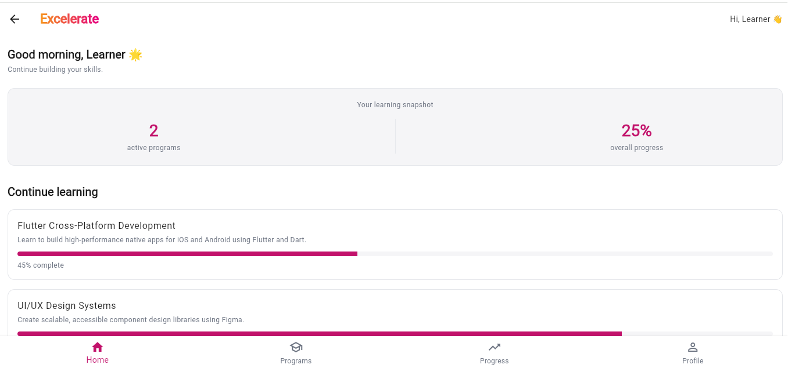
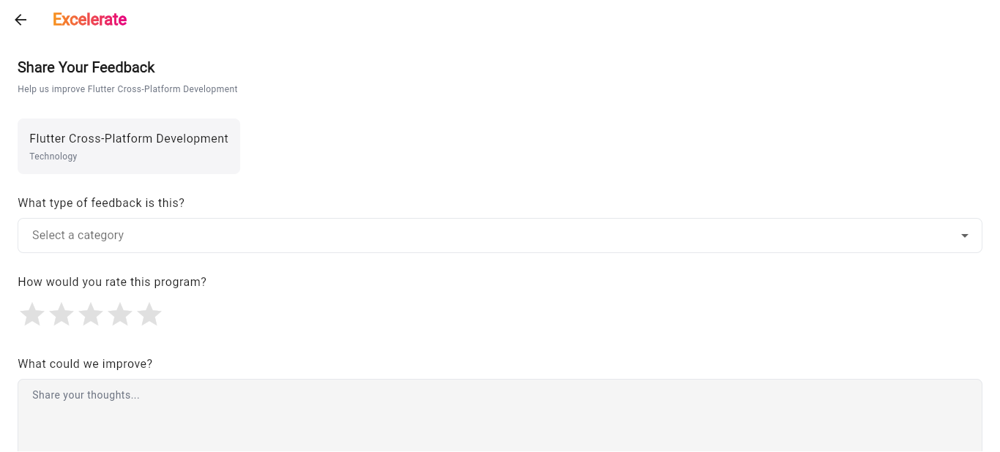
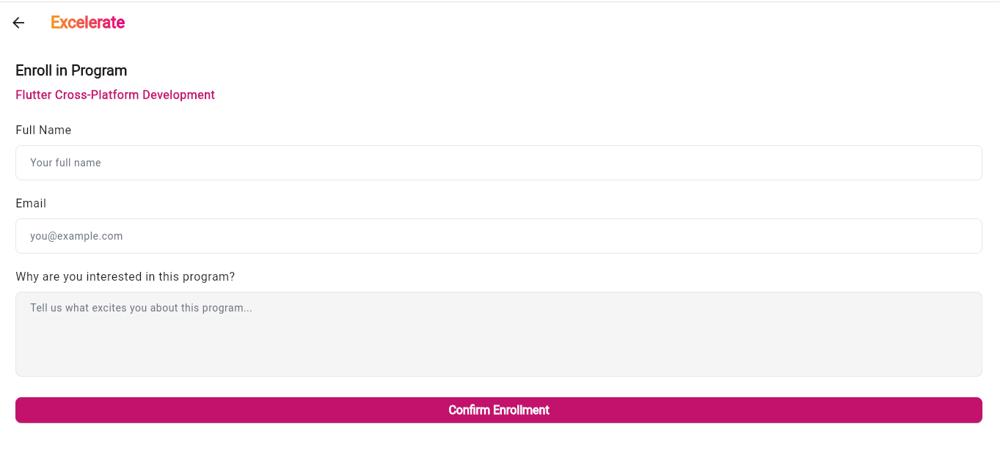

# Excelerate Mobile Learning Companion

Excelerate is a Flutter mobile application for discovering experiential-learning programs, viewing program details, enrolling, and sharing feedback. It is backed locally by a `json-server` mock REST API.

## Features

- Register and sign in with mock API accounts
- Browse the live program catalogue from the mock API
- Search programs and filter by Technology, Business, or Design
- View program duration, learning outcomes, progress, and learning journey
- Submit enrollment requests and feedback
- Persist a mock login token with `shared_preferences`
- Show loading, retry, validation, and network-error states

## Navigation

`Login` → `Home` → `Programs` → `Program Details` → `Enrollment` or `Feedback`

The Progress and Profile navigation items are reserved for future development.

## Project Structure

```text
excelerate-app/
├── Mobile/                         # Flutter application
│   ├── lib/
│   │   ├── core/api/                # HTTP client, endpoint configuration, errors
│   │   ├── models/                  # User, program, enrollment, feedback models
│   │   ├── repositories/            # API-backed data access
│   │   ├── screens/                 # Login, home, catalogue, forms, details
│   │   ├── services/                # Token storage and compatibility helpers
│   │   ├── theme/                   # App theme and branding
│   │   └── main.dart                # Application entry point and routes
│   └── pubspec.yaml
├── mock-api/                        # Local json-server REST API
│   ├── db.json                      # Mock users, programs, enrollments, feedback
│   ├── routes.json                  # API route configuration
│   └── package.json
└── README.md
```

## Getting Started

### Prerequisites

- Flutter SDK 3.0+
- Node.js 16+
- An Android emulator, iOS Simulator, browser, or physical device

### Run the app and mock API together

On Windows, use the launcher below. It starts the mock API when port 3000 is not already in use, then launches Flutter.

```powershell
cd Mobile
.\run_with_mock_api.ps1
```

You can pass normal Flutter arguments too, for example `.\run_with_mock_api.ps1 -d chrome`.
(For vscode Developers only if using another IDE then follow manual instructions for starting API server)

### Start the mock API manually

```bash
cd mock-api
npm install
npm start
```

The API runs on `http://localhost:3000`.

### 2. Run the Flutter app

Open a second terminal:

```bash
cd Mobile
flutter pub get
flutter run
```

The app automatically uses:

- `http://localhost:3000` on Flutter web and iOS Simulator
- `http://10.0.2.2:3000` on Android Emulator

For a physical device, update the API base URL to your computer's local-network IP address.

## Demo Account

```text
Email: demo@excelerate.org
Password: Demo1234
```

You can also create an account from the registration screen. New users, enrollments, and feedback are saved to `mock-api/db.json`.

## Mock API Endpoints

| Endpoint | Purpose |
| --- | --- |
| `GET /programs` | Program catalogue |
| `GET /users?email=<email>` | Find a user during sign-in |
| `POST /users` | Register a user |
| `GET`, `POST /enrollments` | Retrieve or create enrollments |
| `GET`, `POST /feedback` | Retrieve or create feedback |

## Screenshots

- **Login Screen**: User authentication with email and password
- **Home Dashboard**: Main dashboard with navigation and quick links
- **Programs Catalogue**: Browse available experiential learning programs
- **Program Details**: Detailed view of program information and learning outcomes
- **Enrollment Flow**: Step-by-step enrollment process
- **Feedback Flow**: User feedback submission interface

## Installation & Troubleshooting

### Prerequisites Verification
```bash
# Check Flutter installation
flutter doctor

# Check Node.js version
node --version

# Check npm version
npm --version
```

### Common Issues & Solutions

**Issue: Port 3000 already in use**
```powershell
# Find and kill the process using port 3000 (Windows)
netstat -ano | findstr :3000
taskkill /PID <PID> /F

# Or use a different port in mock-api/package.json
```

**Issue: Flutter dependencies not resolving**
```bash
cd Mobile
flutter clean
flutter pub get
```

**Issue: Chrome/Edge not launching**
```bash
# Ensure Chrome or Edge is installed, or try Windows desktop:
flutter run -d windows
```

**Issue: Mock API not responding**
```bash
cd mock-api
npm install
npm start
# Verify at http://localhost:3000/programs
```

### Environment Configuration

- **Web/iOS Simulator**: Automatically uses `http://localhost:3000`
- **Android Emulator**: Automatically uses `http://10.0.2.2:3000`
- **Physical Device**: Update `lib/core/api/` base URL to your computer's IP (e.g., `http://192.168.x.x:3000`)

## API Endpoints Reference

| Method | Endpoint | Purpose | Response |
| --- | --- | --- | --- |
| `GET` | `/programs` | List all programs | Array of program objects |
| `GET` | `/programs/:id` | Get program by ID | Single program object |
| `GET` | `/users?email=<email>` | Find user by email | Array with matching user |
| `POST` | `/users` | Register new user | Created user object |
| `GET` | `/enrollments` | List all enrollments | Array of enrollments |
| `POST` | `/enrollments` | Create enrollment | Created enrollment object |
| `GET` | `/feedback` | List all feedback | Array of feedback entries |
| `POST` | `/feedback` | Submit feedback | Created feedback object |

## Development Workflow

### Code Quality

```bash
cd Mobile

# Static analysis
flutter analyze

# Run unit and widget tests
flutter test

# Format code
flutter format lib/ test/

# Check code style
dart fix --dry-run
dart fix  # Apply fixes
```

### Development Mode

```bash
# Hot reload (preserves state)
r

# Hot restart (rebuilds app)
R

# View logs
flutter logs

# Run with verbose logging
flutter run -v
```

### Build & Release

```bash
# Build web release
flutter build web --release

# Build Windows desktop
flutter build windows --release

# Build Android APK
flutter build apk --release

# Build iOS
flutter build ios --release
```

## Project Status & Changelog

### Version 1.0 - MVP Release
- ✅ User authentication (register/login)
- ✅ Program browsing and search
- ✅ Program filtering by category
- ✅ Enrollment submission
- ✅ Feedback submission
- ✅ Token persistence with shared_preferences
- ✅ Comprehensive error handling

### Planned Features
- 🔜 User profile management
- 🔜 Progress tracking dashboard
- 🔜 Notifications system
- 🔜 Offline mode support
- 🔜 Social sharing capabilities

## Testing

### Unit Tests
```bash
cd Mobile
flutter test --coverage
```

### Integration Tests
- Manual testing recommended for now
- Test flow: Login → Browse → Enroll → Submit Feedback

### Test Account
- **Email**: demo@excelerate.org
- **Password**: Demo1234

Or create a new account via the registration screen.

## Architecture Overview

### Folder Structure Details
- **`core/api/`**: HTTP client configuration, API endpoint definitions, error handling
- **`models/`**: Data models (User, Program, Enrollment, Feedback) with serialization
- **`repositories/`**: API-backed repositories implementing data access layer
- **`screens/`**: UI screens and page navigation
- **`services/`**: Business logic services (auth, token storage, etc.)
- **`theme/`**: App styling, colors, typography, and branding
- **`widgets/`**: Reusable widgets for loading, error states, etc.

### Technology Stack
- **Flutter 3.0+**: Cross-platform mobile framework
- **Dart**: Programming language
- **Provider**: State management
- **shared_preferences**: Local token persistence
- **http**: HTTP client library
- **json_server**: Mock REST API backend
- **Node.js**: Runtime for mock API

## Contributing

When contributing to Excelerate:

1. Create a feature branch from `main`
2. Follow Dart style guidelines (run `dart fix`)
3. Write tests for new features
4. Update README.md if adding new features
5. Submit PR with detailed description

## Support & Resources

- **Flutter Docs**: https://flutter.dev/docs
- **Dart Docs**: https://dart.dev/guides
- **json-server**: https://github.com/typicode/json-server
- **Provider Package**: https://pub.dev/packages/provider

## License

[Add your license here]

---

## Week 4: Final Deliverable

### 📦 Deliverables Checklist

#### ✅ Final Excelerate App
- [x] Complete Flutter app with all key screens
  - Login & Registration
  - Home Dashboard
  - Program Listing & Search
  - Program Details
  - Enrollment Form
  - Feedback Form
- [x] Smooth navigation with consistent branding
- [x] Working data integration with mock API
- [x] Form submissions and validation

#### ✅ GitHub Repository
- [x] Updated repository with full project code
- [x] Polished README.md
  - Project overview and purpose
  - Setup and installation instructions
  - Screenshots and feature descriptions
  - API documentation
  - Development workflow
  - Contribution guidelines
- [x] Clean commit history with meaningful messages
- [x] `.gitignore` configured for Flutter projects

#### 📹 Demo Video (Recommended)
- **Duration**: 2–3 minutes
- **Content**:
  - Login flow demonstration
  - Home dashboard walkthrough
  - Program browsing and search
  - Form submission (enrollment/feedback)
  - Navigation and UI consistency
- **Format**: MP4, YouTube link, or Google Drive link
- **Location**: [Add video link here]

#### 🎬 Reflection Video/Write-up
- **Duration**: 1–2 minutes (or written equivalent)
- **Topics to Cover**:
  - Key learnings (Flutter, UI/UX, API integration, state management)
  - Technical challenges overcome
  - Growth as a developer
  - Project highlights and achievements
  - Future enhancements and vision
- **Location**: [Add reflection link here]

### 📚 Learning Outcomes

By completing Week 4, you will have:

✅ **Finalized a Complete, Functional Flutter App**
- Multi-screen navigation with proper state management
- API integration with error handling
- Data persistence and form submission
- Professional UI with consistent branding

✅ **Professional Project Documentation**
- Comprehensive README with setup instructions
- API endpoint reference documentation
- Architecture and code organization explanation
- Development workflow and contribution guidelines

✅ **Portfolio-Ready Project**
- Published on GitHub with clean history
- Demo video showcasing functionality
- Reflection on learning journey
- Ready to share with employers/clients

✅ **Professional Communication Skills**
- Ability to present and showcase work
- Reflective thinking on development journey
- Documentation and knowledge sharing
- Portfolio-building experience

---

## 360-Degree Evaluation Process

### Self Evaluation
**Definition**: Assess your own performance, achievements, and areas for growth.

**Key Questions to Reflect On:**
- What features did I successfully implement?
- What challenges did I overcome?
- How did I approach problem-solving?
- What technical skills did I develop?
- Where do I see room for improvement?
- How have I grown as a developer?

**Submission**: Completed reflection video/write-up

---

### Peer Evaluation
**Definition**: Feedback from team members on collaboration and teamwork.

**Focus Areas:**
- Communication and collaboration skills
- Code quality and documentation
- Contribution to team success
- Problem-solving approach
- Willingness to help and learn

**Feedback Process**: [Peer evaluation form/survey link]

---

### Managerial Evaluation
**Definition**: Supervisor assessment of overall performance and goal alignment.

**Evaluation Criteria:**
- Project completion and quality
- Technical skill development
- Professional growth
- Meeting deliverables and deadlines
- Initiative and accountability
- Alignment with company values

**Review Timeline**: [Manager review schedule]

---

## Project Status Summary

### ✅ Completed Features
- User authentication (login/registration)
- Program browsing with search
- Program filtering by category
- Enrollment submission
- Feedback submission
- Token persistence
- Error handling and validation
- Comprehensive documentation
- Development workflow setup

### 🔄 In Progress
- Demo video recording
- Reflection write-up
- 360-degree evaluation submissions

### 📋 Next Steps
1. Record demo video (2-3 minutes)
2. Complete reflection write-up
3. Submit all deliverables
4. Participate in 360-degree evaluation
5. Finalize GitHub repository
6. Share project portfolio

---

## Deliverable Submission Checklist

- [ ] Final app code pushed to GitHub
- [ ] README.md updated and polished
- [ ] Screenshots added to repository
- [ ] Demo video recorded and linked
- [ ] Reflection write-up completed
- [ ] All evaluation forms submitted
- [ ] Commit history cleaned up
- [ ] Project documentation complete

---

## Quick Links

- 📱 **App Repository**: [GitHub Link]
- 🎥 **Demo Video**: [Video Link]
- 📝 **Reflection Write-up**: [Reflection Link]
- 📊 **Evaluation Form**: [Form Link]
- 📚 **Project Documentation**: [Docs Link]

## Screenshots





## Development Commands

```bash
cd Mobile
flutter analyze
flutter test
flutter format lib/ test/
```
